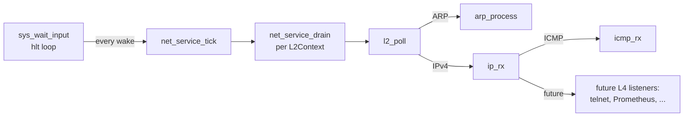
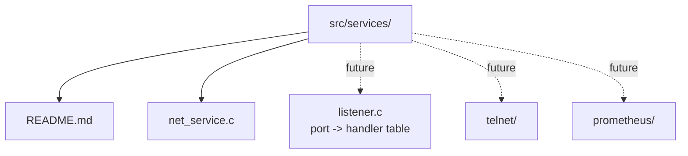

# Architecture Decisions

> **Note:** This document describes the target architecture. The kernel currently runs on a single node. Multi-node clustering, DSM, DPDK, and SPDK are not yet implemented. Sections below describe the intended design, not the current state.

**Audience:** Kernel developers and contributors. For application-level guidance, see [Application Model](../user/application-model.md). For research context, see [Research Overview](../research/overview.md).

Decisions and rationale behind kernel design choices.

Performance is the only driver for this project.
It's meant to live in an isolated environment.

## Boot media model

**Default:** BIOS-bootable ISO (`bin/os.iso`) built with **`xorriso`** using **El Torito no-emulation boot**. The firmware loads `boot-load-size` sectors of `boot/os.bin` (bootsector + kernel) to `0:7C00h`. The bootsector detects CD-ROM boot (`DL >= 0xE0`) and copies the kernel from `0x7E00` to `0x1000` via `rep movsw` (no INT 13h needed). For raw-disk boot (`-hda os.bin`), the bootsector uses LBA or CHS to read the kernel. **GRUB is not used.**

- **Why no-emulation over HDD emulation:** No-emul mode loads the exact bytes we specify. The bootsector handles both CD and raw-disk paths. HDD emulation requires the BIOS to fake a disk geometry, which adds complexity and BIOS-dependent behavior. No-emul is simpler and more portable.
- The ISO contains the OS boot payload and userland tools as a single immutable artifact.
- Runtime disk access is separate from boot: `bin/fat32.img` is attached as an optional data disk during QEMU runs.
- Operational benefit: testing and rollback are version-based (swap ISO), while data disk lifecycle remains independent.

### AHCI, ISO 9660, and VFS

An AHCI SATA controller driver (`src/drivers/ahci.c`) provides access to SATA disks and SATAPI CD-ROM devices. An ISO 9660 read-only filesystem (`src/fs/iso9660.c`) reads files from the boot CD-ROM. A VFS layer (`src/fs/vfs.c`) mounts the ISO at `/` and FAT32 at `/mnt/IDE`. Boot media discovery (`src/kernel/bootmedia.c`) auto-detects and mounts the AHCI SATAPI device at startup.

PCI vendor and class names are loaded at runtime from `/DATA/PCI.IDS` on the boot ISO, rather than compiled into the kernel binary. This keeps the kernel small and allows updating PCI IDs without recompiling.

### Future alternative: GRUB + Multiboot2 (not implemented)

If a GRUB menu or ecosystem integration is required later, the supported approach is **Multiboot2**: link the kernel as **ELF**, add a **Multiboot2 header**, provide a **32-bit protected-mode entry** (per spec), then transition to long mode and reuse the 64-bit bring-up. That implies replacing or bypassing early **BIOS-only** setup (E820, INT 10h) with **Multiboot2 info** (memory map, optional framebuffer). This is a large bootstrap refactor; the El Torito no-emul path remains the default for the current flat-binary, real-mode `kmain` entry.

## Memory allocation

malloc allocates a minimum of 4KB (one page). All allocations are multiples of 4KB.

- No sub-page allocation. This eliminates internal fragmentation tracking and the overhead of splitting/coalescing free blocks.
- The allocator is O(n) bitmap scan with zero metadata per allocation, this need to be improved, maybe removing malloc and giving a (MEM/Cores)-shared statically.
- Fragmentation is a performance problem we avoid entirely by not allowing it.

Trade-off: wastes memory on small allocations. Acceptable for a kernel where most allocations are page-sized anyway (page tables, buffers, per-CPU structures).

## Execution model

- BSP (CPU 0) runs the kernel and multiple ring 3 management tasks via cooperative multitasking.
- BSP tasks: shell (implemented), user program coordinator, telnet server, Prometheus exporter, heartbeat monitor, DSM coordinator (planned).
- BSP cooperative multitasking: per-task struct, yield() syscall, round-robin scheduling. Non-preemptive. Tasks must yield explicitly.
- APs (all other cores): each core runs one user thread in ring 3. No context switching. One thread per core, pinned at creation, never migrated.
- BSP has 2 NICs:
  - Inter-node NIC: dedicated for cluster communication between nodes (layer 2).
  - Management NIC: full TCP/IP stack for SSH, telnet, and maintenance.
- Ring 3 provides memory isolation. Threads cannot corrupt kernel memory or each other (see Thread memory isolation).
- Device MMIO (NICs, storage controllers) is mapped into each thread's address space by the kernel via page tables. Threads access devices directly via polling without syscalls (see Device assignment).

## Syscall interface

Ring 3 tasks access kernel services via the SYSCALL instruction (x86-64). The kernel uses SYSRET to return.

- **Mechanism:** SYSCALL/SYSRET via IA32_STAR, IA32_LSTAR, IA32_SFMASK MSRs. EFER.SCE enabled.
- **Convention:** Linux-style registers. RAX = syscall number, RDI/RSI/RDX/R10/R8/R9 = arguments. Return value in RAX.
- **Per-CPU data:** SWAPGS on SYSCALL entry swaps GS base to &percpu[cpu_idx]. Each CPU sets IA32_KERNEL_GS_BASE during init.
- **Stack switch:** SYSCALL entry saves user RSP to percpu.user_rsp, loads kernel RSP from percpu.stack_top.

GDT layout (GDT64 in kmain.s):

| Offset | Selector | Purpose |
|--------|----------|---------|
| 0x00 | - | Null |
| 0x08 | 0x08 | Ring 0 code |
| 0x10 | 0x10 | Ring 0 data |
| 0x18 | - | Ring 3 compat code (SYSRET placeholder) |
| 0x20 | 0x23 | Ring 3 data |
| 0x28 | 0x2B | Ring 3 64-bit code |
| 0x30 | 0x30 | TSS (16 bytes, runtime-patched) |

## Device assignment

Devices (NICs, storage controllers) are assigned either per NUMA node or per core. Both modes are supported:

- **Per NUMA node:** one device shared by all cores on that node via hardware queues (e.g. RSS/VMDq for NICs). No locking between threads.
- **Per core:** one device per thread. No sharing, maximum throughput.

This applies uniformly to NICs (DPDK) and storage controllers (SPDK, planned).

BSP has 2 additional NICs (inter-node + management). These are separate from the application devices and are reserved as the first 2 NICs in PCI enumeration order (`BSP_NIC_COUNT = 2`). They are not part of the AP assignment pool.

### NIC NUMA proximity discovery

The kernel discovers each PCI device's NUMA proximity from ACPI:

1. **SRAT Type 5** (Generic Initiator Affinity, ACPI 6.3+): direct (segment, BDF) -> proximity_domain mapping. The proper modern mechanism.
2. **DSDT/SSDT AML walker**: for firmware (e.g. QEMU's `pxb-pcie`) that encodes host bridge proximity via `_PXM` in DSDT instead of SRAT. A subset AML walker in `src/arch/aml.c` extracts `Device(_BBN, _PXM)` declarations and the kernel matches a PCI bus to the largest `_BBN <= bus`.
3. **MCFG ECAM base address fallback**: looks up the segment's ECAM base in SRAT memory affinity entries.

### NIC assignment modes

The mode is auto-selected at boot based on resource counts:

- If `AP_NIC_COUNT >= AP_CORE_COUNT`: default is **per-core**
- Otherwise: default is **per-numa**

Where `AP_NIC_COUNT = total_nics - BSP_NIC_COUNT` and `AP_CORE_COUNT = total_cpus - 1`.

The mode can be overridden at runtime via `sys.nic.mode per-core|per-numa`. Both modes respect locality strictly: an AP CPU only ever gets a NIC on its own NUMA node. If no NIC matches, the CPU's `nic_index` is left as `NIC_NONE`.

### ThreadMeta

`src/include/kernel/cpu.h` defines a `ThreadMeta` struct, one per CPU, containing:

- `cpu_index`, `numa_node`
- `nic_index`, `nic_segment`, `nic_bus`, `nic_dev`, `nic_func`, `nic_mac[6]`

This struct is filled at boot by `nic_assign()`. The kernel passes a pointer to the per-CPU `ThreadMeta` in RDI as the first argument to each AP's `_start()` function, so threads can read their own metadata without syscalls. Also visible from the BSP shell via `sys.thread.ls`.

The binary loader (`loader_exec` in `src/kernel/loader.c`) reads a flat binary from the ISO via VFS, loads it at `0x2000000` (32 MB), and dispatches it to all APs via IRETQ. Each AP has its own TSS, GDT/IDT, and SYSCALL MSRs configured during AP startup.

All devices are accessed via polling from userspace (ring 3). No interrupts. BSP handles all interrupts in the system. Device MMIO is mapped into the thread's address space by the kernel.

DMA buffers, driver state, and the thread touching the data are all on the same NUMA node. Zero copy. No cross-node memory access for I/O.

## Network stack

The network stack is shared: one copy of the sources in `src/net/` compiles into both `kernel.bin` (via `src/Makefile`) and `apps/libc/libc.a` (via `apps/libc/Makefile`). Each build supplies its own `NetBackend` vtable (kernel: `nic_send/nic_recv`, AP: `SYS_NIC_SEND/SYS_NIC_RECV`) so the layers themselves have no kernel-vs-userland forks.

### L2 layer

`L2Context` owns a per-NIC Ethernet + ARP view: MAC, ARP table (32 entries), pre-allocated `PktBufPool` for zero-copy RX/TX, per-layer stats. `l2_poll` validates the Ethernet header, filters on destination MAC or broadcast, handles ARP internally (updating the table, sending replies for our IP), and hands non-ARP payloads back to the caller. `l2_send` / `l2_send_zc` build the header and push the frame through the backend.

### L3 layer (IPv4)

IPv4 rides directly on top of L2: the same `L2Context` carries the L3 configuration (`ip`, `mask`, `gw`, `mtu`, `forward`) and an `IpStats` block. There is no separate IpContext struct, because in this design there is exactly one IP per interface and per-AP threads own their own L2+L3 state end to end.

`ip_rx` in `src/net/ip.c` validates version / IHL=5 / total_len / fragment bits / checksum. If the destination is our IP, it dispatches by protocol (today: ICMP only, via `icmp_rx`). Otherwise, if `forward` is set and TTL > 1, it decrements TTL, recomputes the checksum, resolves the next hop via the on-link / default-gateway decision, and hands the frame back to L2. All other cases drop with a counter.

`ip_send` builds a header with DF=1 (no fragmentation), picks the next hop the same way (on-link if `(dst & mask) == (ip & mask)` else `gw`), resolves via ARP, and delegates to `l2_send`. On ARP miss it emits an ARP request and returns -1 so the caller can retry later.

ICMP in `src/net/icmp.c` handles Echo Request (auto-reply, copying the payload and flipping the type) and counts Echo Replies for use by `sys.net.ping`. All other ICMP types drop. Destination Unreachable / Time Exceeded / Frag Needed emission is deliberately deferred.

Checksums are software-only (`ip_checksum` is a shared RFC 1071 one's-complement helper). The virtio-net driver negotiates no offload features.

### BSP mgmt NIC vs. AP apps

The BSP management NIC (NIC 0) is initialised by `l2_kern_init` with hard-coded defaults matching the QEMU user netdev (`10.0.2.15/24`, gw `10.0.2.2`). The shell commands `sys.net.ping`, `sys.net.ip`, `sys.net.route`, and `sys.net.stats` drive it. `net_service_drain(ctx)` is called at the start of every `sys.net.*` handler and dispatches IPv4 frames to `ip_rx` inline.

AP apps (today: `apps/dpdk_l3`) read their manifest-supplied IP/mask/gw/mtu/forward from the kernel via `SYS_APP_NET_CFG` (the app does not parse INI itself) and stuff the values directly into their `L2Context`. Each AP polls its own NIC and runs its own L3 - no cross-core coordination, no locks.

## Services

`src/services/` is the pluggable services tree -- kernel modules that consume the network stack and respond passively on the BSP's behalf. Each service is a discrete module visible in the source layout (its own `.c` plus header under `src/include/services/`, or its own subdirectory once it grows). Today the directory holds the foundation only; telnet, Prometheus exporter, syslog receiver, etc. land here as siblings when they're built.

### `net_service` -- the foundation

The L3 milestone shipped a stack that only processed packets when a `sys.net.*` shell handler ran. Once we have telnet, a Prometheus exporter, ARP-passive responses, etc., that on-demand model breaks: passive responders cannot rely on the user typing between every packet. `net_service` is the BSP polling foundation that all of those services sit on.



`net_service_tick()` is wired into `sys_handle_wait_input`'s hlt loop, immediately after `app_check_completion()`. Each tick drains every BSP-owned `L2Context` (mgmt + inter-node) up to 16 frames per context. The per-frame existing dispatch (`l2_poll` -> `arp_process` / `ip_rx` -> `icmp_rx`) does the rest.

There is no separate BSP task. The cooperative scheduler is single-task today, so a second task would only run when the first yields -- exactly what the hlt loop already gives us. Two tasks touching one `L2Context` would invent the concurrency exposure the project explicitly avoids.

### Foundation invariants

- **Cooperative serialization.** No locks; the foundation and shell handlers never run concurrently.
- **No malloc.** Static stats struct; bounded drain budget.
- **Non-reentrant.** `net_service_tick` is guarded against recursion via an `in_tick` flag.
- **Bounded per-tick work.** 16 frames per NIC per tick caps per-tick CPU spend under flood.

### Pluggable layout



When the first L4 consumer arrives (telnet, Prometheus exporter, or the first UDP service), a shared `(proto, port) -> handler` table will land alongside `net_service` and be looked up inside `udp_rx` / `tcp_rx`. No code ships before that consumer; the shape is documented in `src/services/README.md`.

## ACPI

- FACP power saving
  - C states: We won't go deeper than C1 (hlt).
  - P states: We'll keep the CPU at max frequency.
  - T states: We'll ignore them, just cool your CPU appropriately.
- ACPI root table discovery supports RSDT (ACPI 1.0) and XSDT (ACPI 2.0+), with checksum validation.
- Parsed tables:
  - MADT (CPU/LAPIC/IOAPIC/ISA overrides)
  - SRAT (CPU and memory NUMA affinity)
  - SLIT (NUMA distance matrix)
  - HPET (timer MMIO metadata)
  - FADT/FACP (PM timer and reset register)
  - MCFG (PCIe ECAM segments)
  - DMAR / IVRS (IOMMU unit discovery)
- Exposed through ACPI query functions so shell/scheduler/memory/PCI/reboot code can consume parsed data without reading raw ACPI structures directly.

## Device libraries

The OS provides userspace libraries for direct device access from ring 3:

- **DPDK** (NICs): DMA ring management, packet buffer allocation (NUMA-local), TX/RX descriptors, per-thread hardware queue assignment. Full TCP/IP available through the library.
- **SPDK** (storage controllers, planned): direct storage access, following the same pattern as DPDK.

Both follow the same design: kernel maps the device MMIO, userspace library drives it via polling. All memory given to the libraries is NUMA-local to the thread.

In Linux, DPDK is a workaround against the OS: it bypasses the kernel to poll the NIC from userspace. Here, direct device access is the intended design. The kernel maps the device and provides the library. There is nothing to bypass.

## Thread-core binding

- Threads run in ring 3. One thread per core. Pinned at creation, never migrated during normal operation.
- Device access through mapped MMIO, not syscalls. Polling, not interrupts.
- A thread's core determines its NUMA node. Its stack, heap allocations, and working set are all local to that NUMA node.
- There is no migration and no load balancing. The scheduler is a one-time placement solver (see README section 7). It runs again only on node failure to reschedule dead threads to available cores.

## Thread memory isolation

Each AP loads its own CR3, pointing to its own PML4T. This gives each thread a fully independent address space: different virtual-to-physical mappings, different permission bits, complete isolation. Intel MPK (Skylake+) can toggle read/write permissions per-thread within a shared address space, but is limited to 16 protection keys and does not provide address space separation. Per-thread CR3 is the stronger mechanism and the one Isurus uses.

One thread per core, no context switching. CR3 is loaded once during AP startup and never changes.

Three virtual address zones per thread:

```
Virtual address space (per thread):
+---------------------------+
| Kernel (supervisor)       |  Identical in all page tables. Same physical pages.
|                           |  Thread cannot access (ring 3 vs ring 0).
+---------------------------+
| Thread-private (user)     |  Only mapped in THIS thread's page table.
|  - Stack                  |  Physically allocated on thread's NUMA node.
|  - Private heap           |
|  - Device MMIO            |
+---------------------------+
| Shared region (user)      |  Mapped in ALL thread page tables at same VA.
|  - Cross-thread data      |  Physical pages may span multiple NUMA nodes.
|  - Coordination structs   |
+---------------------------+
```

Kernel and shared regions reuse the same physical page table pages across all PML4Ts. Only the private region's page table entries differ per thread. This keeps memory overhead small: ~16KB per thread (PML4T + private region page tables).

Private memory includes the thread's stack, local heap, and device MMIO (NICs, storage controllers assigned to the thread). All private allocations are physically on the thread's NUMA node.

Shared memory is for cross-thread data and coordination structures. Each shared page has a single writer; other threads read. Pre-partitioned at boot: each thread gets a fixed shared slice (inbox/outbox pattern). BSP-managed allocation is available for the rare case where dynamic shared memory is needed (thread requests allocation via syscall, BSP allocates, no lock contention because BSP is single-threaded).

### Locality map

A read-only page at a fixed virtual address, mapped into every thread's page table at boot. It tells each thread the locality tier of every shared slice:

- **Tier 1: same NUMA node.** Local memory read. Cheapest.
- **Tier 2: same machine, different NUMA node.** Cross-NUMA read. Hardware cache coherence applies. No network.
- **Tier 3: remote machine.** First access triggers a DSM page fault through BSP. Subsequent reads are cached until invalidated.

The map is static by design. It reflects initial placement and is intentionally not updated on failover. After a node failure, the map may be stale (a tier 1 slice may now be tier 3 because the writer was rescheduled elsewhere). This is a deliberate trade-off: updating the map would require synchronizing all threads cluster-wide, adding complexity to an already degraded state. Correctness is preserved (addresses still work), only performance degrades. See Thread re-instantiation for details.

## Shared memory and DSM

### Local shared memory

Local shared pages (same machine) are mapped at boot into all thread page tables at the same virtual address. Mappings are static; no TLB shootdowns needed. Hardware cache coherence handles consistency automatically within a single machine.

### Remote shared memory (cross-machine DSM)

Remote shared pages are fetched on demand via page faults. All DSM traffic goes through BSP's inter-node NIC (layer 2). The per-NUMA-node NICs are mapped into ring 3 for DPDK and cannot be used by the kernel.

1. Remote pages are initially unmapped (not present) in the local page tables.
2. When a thread accesses a remote page, a page fault fires (ring 0 on the faulting AP core).
3. The AP's fault handler sends an IPI to BSP with the faulting address.
4. BSP sends the request to the owning node over the inter-node NIC.
5. The owning node sends back the 4KB page contents to BSP.
6. BSP copies the page data into a pre-allocated frame on the faulting AP's NUMA node, updates the AP's page table to map it read-only, and sends an IPI to wake the AP.
7. The AP resumes the thread. The faulting instruction retries and succeeds.
8. The page is now cached locally. Writes require the coherence protocol (see below).

BSP serializes all DSM requests for the machine. This is acceptable because remote faults should be rare by design (data is partitioned, working sets are local). DSM fault frequency is exported via the Prometheus exporter for monitoring.

Why this is different from historical DSM systems (Treadmarks, Munin, Ivy):

- The kernel IS the DSM layer. Page fault to network request is a straight code path with no context switches, no syscall overhead.
- Layer 2 transport. No TCP/IP stack in the data path.
- NUMA-aware thread placement minimizes remote faults. Data can be partitioned so each thread's working set is mostly local.

Mitigation: align each thread's shared slice to page boundaries so a single page is never split across two writers' slices.

## Coherence protocol

Single-writer / multiple-reader. Ownership is permanent; each shared slice belongs to the thread that created it and never changes.

Writers write to their own slice. Readers on remote nodes fetch pages on demand (see Remote shared memory above). Fetched pages are cached read-only. When the writer modifies a page, the coherence protocol invalidates all cached copies:

1. Writer thread on node A modifies page P.
2. Node A sends INVALIDATE(P) to all nodes holding cached read-only copies.
3. Remote nodes unmap page P from their local page tables and ACK.
4. Next time a reader on a remote node accesses page P, it faults and fetches the updated copy.

BSP tracks which nodes hold cached copies of which pages. Invalidation is coordinated through BSP.

Another option would be to directly send the invalidated page to replace. This should be proposed as an option.

## Page replication for fault tolerance

All shared pages are replicated to a backup node on a different physical machine. Private thread memory is not replicated (thread is re-instantiated fresh on failure).

Write path: the writer's node sends the update to the backup synchronously. This guarantees the backup is never behind. Trade-off: every write to a shared page pays one extra network round trip. Acceptable for write-rare shared data (the common pattern in this architecture).

Backup selection: different physical machine, ideally latency-close to minimize replication latency.

Failover on node failure:

1. BSP detects dead node via heartbeat timeout.
2. BSP promotes the backup for all shared pages whose writer was on the dead node.
3. BSP broadcasts the updated page location map to the cluster.
4. Threads holding read-only cached copies of dead node's pages continue reading (data is still valid from the backup).
5. Threads that fault on pages from the dead node are redirected to the backup.

## Thread health and fault isolation

- Threads must heartbeat: periodically write to a designated memory area.
- If a thread stops updating its heartbeat, it is considered dead.
- Dead thread is killed, its NIC queue is reset, and the thread is re-instantiated.
- Fault isolation goal: a misbehaving thread should not kill the whole process across the cluster. At worst, kill the thread. Possibly kill the node, but never the entire cluster process.
- Implementation approach TBD. Areas to explore: page-level protection, NIC queue isolation, watchdog on BSP.
- When a node fails, BSP promotes backup pages to primary ownership (see Page replication for fault tolerance).
- Threads holding read-only cached copies of the dead node's pages continue reading; the data is still valid since the dead thread was the only one able to write there.
- About dead thread's shared write slot, still have to determine if:
  - Dead thread's shared write slot is untrusted until BSP scrubs it. Other threads must not read from a slot whose owner is dead (single-writer principle: the writer is gone, so the data may be partial).
  - Shared memory is not scrubed and new instance of thread restarts with it.

### Thread re-instantiation

When a single thread fails, BSP re-instantiates it on the same core. The thread restarts its task from scratch with fresh private memory. Shared page ownership is restored from backups if needed.

When an entire node fails, all threads on that node must be rescheduled. BSP places them on available cores elsewhere in the cluster, respecting NUMA affinity rules (threads that were co-located on the same NUMA node should remain co-located if possible). If no cores are available, tasks are queued until cores are freed.

A rescheduled thread keeps its original shared memory mappings at the same virtual addresses. It does not know it has moved. However, shared pages that were tier 1 (same NUMA node) or tier 2 (same machine) at the original placement may now be tier 2 or tier 3 from the new location. The thread silently pays higher latency for those accesses. The locality map is not updated; it still reflects the original placement. This is a trade-off: correctness is preserved (the addresses still work), but performance degrades. This is accepted because failover is a catastrophic event, not normal operation.

## Cluster memory model

A cluster is modeled as additional NUMA nodes with higher latency. From the scheduler's perspective, a remote machine is just another NUMA domain - same abstraction, different latency numbers.

- Inter-node communication goes over the dedicated NIC on BSP (layer 2).
- Management traffic goes over the separate management NIC on BSP (TCP/IP).

Memory on remote nodes is accessible but expensive. The allocator prefers local memory. Remote allocation requires explicit intent. Coherence across machines is handled by the DSM layer: remote pages are fetched on demand via page faults. Each shared slice has a permanent writer; readers fetch and cache pages read-only (see Coherence protocol).

**Current status:** the kernel runs on a single node with PCI enumeration (ECAM), virtio-net driver, and NIC abstraction layer implemented. The cluster memory model, DSM layer, coherence protocol, inter-node communication, and userspace device libraries (DPDK, SPDK) described above are the target architecture and are not yet implemented.

## Libc

Isurus ships a minimal libc providing malloc, printf, string operations, math, time and helper functions for memory areas mentioned aboved. No POSIX. No dynamic linking; all binaries are statically linked. There is no dynamic linker.

## Timer architecture

Isurus uses the TSC (Time Stamp Counter) for nanosecond-resolution timing. RDTSC/RDTSCP is the primary runtime clock source on AP threads. ACPI HPET and FADT PM timer are parsed and exposed for calibration/validation and platform timing metadata. ACPI reset register (FADT) is used as the preferred reboot path when available, with existing fallback reset methods preserved.

Cross-node time synchronization through PTP will provide consistent timestamps across all machines in the cluster, enabling coordinated timing for distributed workloads.
