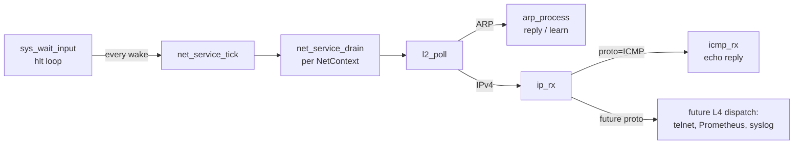
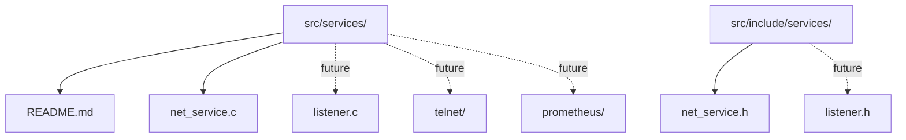

# `src/services/` -- pluggable BSP services

This directory holds **kernel services** that consume the BSP network
stack and provide passive responders on top of it. The first
inhabitant is `net_service`, the polling foundation; future services
(telnet daemon, Prometheus exporter, syslog receiver) hook into it as
siblings.

## Why a separate tree

`net/` is the wire stack -- Ethernet, ARP, IP, ICMP, UDP. It is
called from above. `services/` is the *above*: things that
continuously drive the wire stack and answer to the network on the
BSP's behalf. Keeping them in their own tree makes the pluggable
nature visible in the source layout: each service is a discrete
module sitting next to the others, all sharing one foundation.

## The foundation: `net_service`

`net_service.c` is the only inhabitant today. It owns one
responsibility: drive the BSP-owned `NetContext` instances
(management NIC, inter-node NIC) so packets get processed without
shell input.

### Call chain



### Hook point

`net_service_tick()` is called from `sys_handle_wait_input` in
`src/kernel/syscall.c`, immediately after `app_check_completion()`.
The shell task's idle is the foundation's heartbeat. There is no
separate BSP task; the cooperative scheduler is single-task today
and a second task would only run when the first yields, which is
exactly what the hlt loop already gives us.

### Direct drain

Shell handlers that want fresh stats or a fresh ARP table call
`net_service_drain(ctx)` directly before printing. Same shape as
the tick, single context, used from `sys.net.arp`, `sys.net.stats`,
and the polling loops in `sys.net.ping` / `sys.net.arping`.

## Invariants (foundation contract)

Every service in this tree must respect:

1. **Cooperative serialization.** No locks. The BSP runs one task at
   a time; `net_service_tick` and shell handlers never run
   concurrently. The single-writer-per-`NetContext` doctrine holds.
2. **No malloc.** Static buffers, fixed-size tables. Same rule as
   AP threads.
3. **No reentrancy.** `net_service_tick` checks an `in_tick` flag.
   A handler called from inside the tick that itself reaches the
   tick (via `sys_wait_input`) returns immediately.
4. **Bounded per-tick work.** `net_service` drains at most 16 frames
   per `NetContext` per tick (`L2_BATCH_MAX / 2`). DoS / starvation
   bound under host flood.
5. **ASCII only.** Per `ai.rules`.

## Future shape: pluggable port -> handler table

When the first L4 consumer arrives (telnet on TCP/23, Prometheus
exporter on TCP/9090, or the first UDP service), a shared listener
table will live in this tree:

```
src/services/
|-- listener.{c,h}        # port + proto -> handler
|-- telnet/               # TCP/23 listener registers here
`-- prometheus/           # TCP/9090 listener registers here
```

The intended shape is a small linear-scan table keyed by
`(proto, port)`, looked up inside future `udp_rx` / `tcp_rx` to
dispatch each incoming datagram or segment. **No code lands until
there is a real consumer** -- premature abstraction is an
explicit anti-pattern in this project.

## Directory layout (today and planned)


